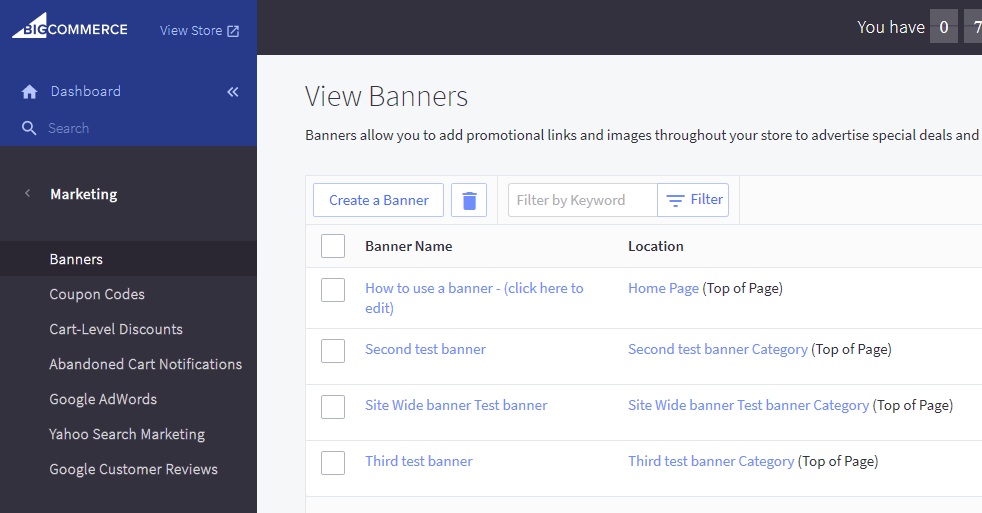
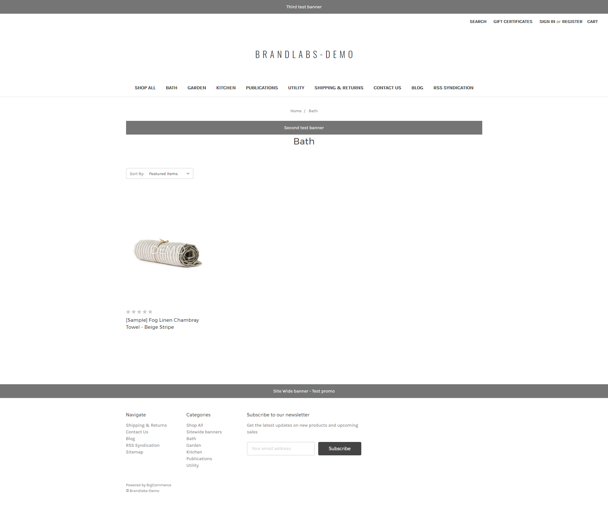

# BigCommerce Site Wide Banners

Provides a way to enable sitewide banners on your BigCommerce store theme.

## Getting Started

These instructions will get you a new category called __Sitewide Banners__ on your store and a test banner to show it's working.

### Prerequisites

Nodejs v8+ (we assume you have installed something like nvm for changing Node versions).

Have a valid `.stencil` file as documented [here](https://stencil.bigcommerce.com/docs/initializing-stencil#legacy).

### Installing

You need to add `grunt.loadNpmTasks('bigcommerce-sitewide-banners');` on your theme GruntFile.js.

On your terminal run `grunt bigcommerce-sitewide-banners:init`

Running this command we
- create a template file
- add a line on `theme.scss` to hide the _sitewide banner_ Category (since BigCommerce adds this as a menu item)
- add a line to `.stencil` file for local development
- create Sitewide banner Category page using the BigCommerce API
- create a test banner using the BigCommerce API.

Manual steps:
- On global.js file you need to call the `getBanner()` function based on your preferences (We like on the `before` function call);
- Bundle your theme and upload it into your store.
- Apply the uploaded theme.
- Go to __Products__ > __Product Categories__ and click on __Sitewide banners__ Category.
- On __template file__ dropdown select `sitewide-banners`. Click __Save & Exit__.

You can follow the explanatory video where we show some settings for our package on the __assets__ folder.

### Some notes

Since we're creating a Category for sitewide banners BigCommerce places it as menu item. If you want to remove it from the DOM, you could add on `global.js` (or on your specific script) lines like these:

```javascript
    const $siteWideMenu = document.querySelector(`.navPages-action[href="/sitewide-banners/"]`);
    if ($siteWideMenu) {
        $siteWideMenu.parentNode.removeChild($siteWideMenu);
    }
```

You can place the banner on top of any DOM element you want as long as it's an element present on the page. You can do it passing a CSS selector to `getBanner()` on _global.js_, an example can be `getBanner('header.header')` (where top banners are placed). If nothing is passed, banners are placed by default on header (for top banners) or the footer (for bottom ones).

## Example

Say, we have three banners applied into our Sitewide Banners Category on our store:

;

and we want to apply these on all pages, one at the top, one at the bottom and one above the title (if it exists). This is how we applied it on `global.js` (we omitted all non-to our example code).

```javascript
import SiteWideBanner from 'bigcommerce-sitewide-banners';

export default class Global extends PageManager {
    before(next) {
        const swb = new SiteWideBanner();
        swb.getBanners()
            .then(banners => {
                swb.addBanners({ banners: [banners.top[0]] });
                swb.addBanners({ place: 'bottom', banners: [banners.top[1]] });
                swb.addBanners({ place: '.page-heading', banners: [banners.top[2]] });
            })
            .catch(error => console.error(error));

        next();
    }
}
```

You need to check the order of the banners (BigCommerce put the latest created on index `0` in this case).

You see we pass arrays for the `banners` property. You can use more than one banner at the same time at the same place.

If nothing is passed as the argument, top banners are assumed. If no top banners, we check for bottom ones.

This is how it looks on our demo page:



You need to call `addBanners` every time a banner is needed on another location

You also need to better handling for the `catch` part but it's good enough for our example.

## Notes
- Since BigCommerce doesn't transpile external package code (for oldies like IE11), we provide transpiled files inside __dist/__ folder. You can access these files adding an alias on your `webpack.conf.js` file like `'bigcommerce-sitewide-banners': path.resolve(__dirname, 'node_modules/bigcommerce-sitewide-banners/dist/sitewide-banners.min.js')`

## Authors
* Carson Reinke
* Hector Fernando Hurtado

## License

This project is licensed under the MIT License - see the [LICENSE](LICENSE) file for details
